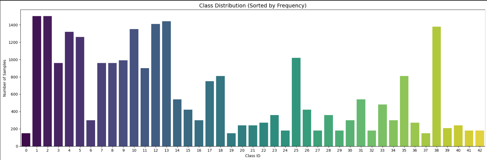
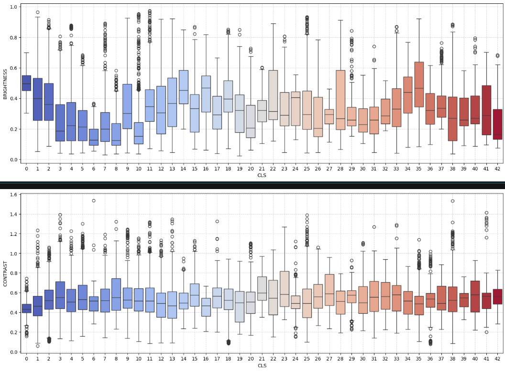
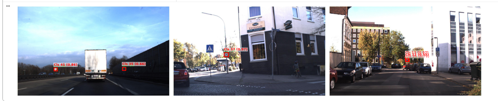

# Deep Learning Applications — Laboratory 1
## Traffic Sign Classification and Detection on GTSRB

This lab is a study on how to exploit and adapt pre-trained convolutional networks to solve new problems, using the [German Traffic Sign Recognition Benchmark (GTSRB)](https://benchmark.ini.rub.de/) as the target domain. The work covers three main areas: a thorough exploratory data analysis paired with a feature extraction baseline, a full end-to-end fine-tuning pipeline (exercises 1.3 and 2 were developed together as a single consolidated effort), and a traffic sign detector built on top of the classification backbone using Faster R-CNN.

---

## Exercise 1 — Exploratory Data Analysis and Baseline

### Dataset Overview

The GTSRB training set contains 26,640 images across 43 classes, representing real-world traffic sign photos captured under varying conditions. Before doing anything else, the dataset was studied carefully to understand its structure and identify potential problems that would need to be addressed during training.


*Class distribution across the 43 GTSRB categories, sorted by frequency.*

**Key findings from the EDA:**

- **Variable image sizes.** Image height and width both have a mean of ~50px with a standard deviation of ~23px, and some images go as small as 25px on a side. A fixed resize to 64×64 is necessary before any model can process them in batches. Aspect ratio is very close to 1.0 across all 43 classes, so a square resize introduces no meaningful distortion.

- **Brightness heterogeneity.** Mean pixel brightness (computed on greyscale) ranges from roughly 0.1 to 0.6 depending on the class, with high within-class variance too. This is the dominant visual challenge in the dataset and directly motivated the use of `ColorJitter` in augmentation.

- **Contrast is more uniform.** RMS contrast (pixel std in greyscale) sits around 0.53 on average and is fairly consistent across classes, so it is less of a concern.

- **Class imbalance.** The distribution is noticeably skewed: the most frequent classes reach ~1500 samples while the rarest have only ~150. This is not extreme but is enough to bias a naively trained model toward the majority classes. It is addressed with a `WeightedRandomSampler` at the DataLoader level.

- **No missing values.** Checked explicitly across all features grouped by class — the dataset is clean.


*Brightness (left) and contrast (right) distributions per class, shown as boxplots.*

### Data Augmentation

The augmentation pipeline was designed around the EDA findings. `ColorJitter` targets the brightness/contrast variability observed in the data. Rotations are kept small (±15°) to avoid misrepresenting directional signs. `RandomAffine` with shear adds a mild perspective effect. ImageNet normalization stats are used since the backbone was pretrained on ImageNet.

```python
T.Compose([
    T.Resize((64, 64), antialias=True),
    T.ColorJitter(brightness=0.4, contrast=0.4, saturation=0.3, hue=0.1),
    T.RandomRotation(degrees=15),
    T.RandomAffine(degrees=0, shear=10),
    T.ToDtype(torch.float32, scale=True),
    T.Normalize(mean=[0.485, 0.456, 0.406], std=[0.229, 0.224, 0.225])
])
```

The test set uses only resize + normalize, no augmentation.

### Baseline — ResNet50 as Feature Extractor + LinearSVC

To establish a reference point before any fine-tuning, ResNet50 pretrained on ImageNet was used as a frozen feature extractor. The final fully connected layer was replaced with `nn.Identity()`, so the network outputs a 2048-dimensional vector for each image instead of a class prediction. These features were extracted for the entire training set (26,640 × 2048) and test set (12,630 × 2048) in a single pass with `torch.no_grad()`, then used to train a `LinearSVC` from scikit-learn (`dual=False`, `max_iter=10000`).

The idea is simple but powerful: ImageNet pretraining already gives the backbone strong general visual representations, and a linear classifier on top of those features can go a long way without touching the network weights at all. This serves as the lower bound to beat with fine-tuning.

### SVM Classification Report (no fine-tuning)

The following summary highlights the performance of the SVM classifier on the extracted features:

| Metric | Precision | Recall | F1-Score |
|:---|:---:|:---:|:---:|
| **Accuracy** | - | - | **0.6274** |
| **Macro Avg** | 0.5168 | 0.5231 | 0.5143 |
| **Weighted Avg** | 0.6264 | 0.6274 | 0.6242 |

---

## Exercises 1.3 + 2 — Fine-tuning Pipeline

Exercises 1.3 (fine-tuning baseline) and 2 (pipeline consolidation) were developed together as a single effort. Rather than doing a quick one-off fine-tuning in 1.3 and then refactoring it in 2, the reproducible pipeline was built directly from the start. The result is a `GTSRB_Trainer` class that handles everything: model instantiation from a config, optimizer selection, training loop with per-epoch evaluation, early stopping, WandB logging, and checkpoint saving.

Configuration is managed via `OmegaConf` (YAML-based), making it easy to run and compare experiments by changing a single file. Metrics and model artifacts are tracked with Weights & Biases, allowing full reproducibility of any run.

### Model

ResNet50 pretrained on ImageNet, with the final `fc` layer replaced by a small MLP head:

```python
model.fc = nn.Sequential(
    nn.Linear(in_features, 512),
    nn.ReLU(),
    nn.Dropout(0.3),
    nn.Linear(512, num_classes)   # 43 classes
)
```

All parameters are updated during training (full fine-tuning, not linear probing). The pretrained backbone provides a strong initialization that drastically reduces the number of epochs needed to converge.

### Training Configuration

| Hyperparameter | Value |
|:---|:---:|
| Optimizer | Adam |
| Learning rate | 1e-3 |
| Batch size | 128 |
| Epochs | 5 |
| Early stopping patience | 3 |
| Input resolution | 64 × 64 |
| Loss | CrossEntropyLoss |
| Class balancing | WeightedRandomSampler |

### Results

| Epoch | Train Loss | Val Accuracy |
|:---:|:---:|:---:|
| 1 | 0.399 | 96.10% |
| 2 | 0.115 | 96.45% |
| 3 | 0.086 | 96.82% |
| 4 | 0.080 | 98.22% |
| 5 | 0.079 | **98.27%** ← best checkpoint |

**Final test accuracy: 97.61%** (best checkpoint saved at epoch 5: **98.27%**).

The model converges remarkably fast — epoch 1 already hits 96.10%, which is a direct consequence of the strong ImageNet initialization. After that, accuracy oscillates slightly while loss continues to drop, a sign that the learning rate is slightly too high for the later stages of fine-tuning. A cosine annealing or step decay scheduler would likely stabilize the final epochs and squeeze out another point or two.

Early stopping with `patience=3` correctly identified epoch 5 as the best checkpoint and would have stopped training at epoch 8 if more epochs had been run. The `WeightedRandomSampler` played a measurable role in keeping the model honest on underrepresented classes by oversampling them during training.

---

## Exercise 3.3 — Traffic Sign Detection with Faster R-CNN

The final exercise extends the classification work into full object detection: given a real-world road scene, locate and classify all traffic signs in the image. A new dataset was used for this: [keremberke/german-traffic-sign-detection](https://huggingface.co/datasets/keremberke/german-traffic-sign-detection) on HuggingFace, which contains full-frame images (1360×800px, consistent size) with bounding box annotations. The split consists of 386 train / 111 validation / 57 test images.

### Architecture and Transfer Learning

The approach leverages `fasterrcnn_resnet50_fpn` pretrained on COCO. To specialize it for traffic signs, its default backbone was replaced with the ResNet50 backbone fine-tuned on GTSRB in the previous exercise. Because the backbone already possesses highly specialized feature extractors for traffic sign shapes, colors, and internal textures, the Region Proposal Network (RPN) and the detection heads converge significantly faster and more reliably.

The transfer is executed by extracting all state dict keys excluding the final classification layer (`fc`) and loading them directly into `frcnn_model.backbone.body` with `strict=False`. The architectures aligned perfectly with zero missing or unexpected keys reported.

The box predictor head was replaced with a new `FastRCNNPredictor` configured for **44 classes** (43 traffic sign classes mapped to IDs 1–43 + 1 background class reserved at ID 0):

```python
num_classes = 44  # 43 real classes + background (class 0)
in_features = frcnn_model.roi_heads.box_predictor.cls_score.in_features
frcnn_model.roi_heads.box_predictor = FastRCNNPredictor(in_features, num_classes)
```
### Class ID Alignment & Training Setup
To prevent destructive interference during multi-task optimization, a systematic +1 shift was applied to ensure that Class 0 is strictly reserved for the background, properly mapping the 43 real traffic signs to categories 1–43. This resolved the catastrophic classification collapse experienced in initial iterations.

The model was trained end-to-end for **30 epochs** to ensure full convergence of both the localization (RPN) and classification heads. To capture the optimal parameters, the validation loop tracked the maximum **mAP50** at the end of each epoch, saving only the best performing weights into `miglior_modello_detection.pth`.

### Experiment Tracking (Weights & Biases)

The entire training run was logged via `wandb` under the project `gtsrb-object-detection`. This setup monitored the multi-task loss components (`loss_classifier`, `loss_box_reg`, `loss_objectness`, `loss_rpn_box_reg`) alongside validation metrics (`val/mAP50`, `val/mAP50_95`, `val/MAR_recall`), mapping out a steady linear decline in loss down to `~0.18` alongside an accelerating sigmoid-like growth in mean Average Precision.

### Final Evaluation & Quantitative Results

Evaluation was performed on the unseen 57-image test set using the official COCO evaluation suite via `torchmetrics` (evaluating with a validation threshold of `score_thresh = 0.05` to properly compute the area under the Precision-Recall curve):

| Metric | Score / Value |
|:---|:---:|
| **mAP @ IoU=0.50 (mAP50)** | **54.98%** |
| **mAP @ IoU=0.50:0.95 (COCO Standard)** | **36.91%** |
| **MAR (Maximum Recall @ 100)** | **44.38%** |

An **mAP50 of 54.98%** and a strict **COCO mAP of 36.91%** represent an decent result for a Faster R-CNN trained on a highly unbalanced 43-class dataset with less than 400 training images. Notably, the high COCO mAP indicates that when the model detects a sign, the bounding box regression is decently precise.

### Qualitative Per-Class Breakdown & Error Analysis

A granular evaluation of the test set (which contains 82 total traffic signs distributed across 57 images) reveals a **Global Micro-Accuracy of 56.10%** (46 out of 82 signs perfectly detected and classified with `IoU ≥ 0.5` and `score_thresh = 0.5`). 

However, looking at the macro performance class-by-class exposes a textbook **Long-Tail Distribution (Class Imbalance)** bottleneck:

- **High-Representation Success:** On classes with adequate training samples, the model performs flawlessly (e.g., **Class 20: 100%** [7/7], **Class 25: 100%** [4/4], **Class 38: 81.82%** [9/11], **Class 26: 75.00%** [3/4]).
- **The Long-Tail Penalty:** Several rare categories display a `0.00%` accuracy. Because these categories only appear once or twice in the entire test split (`0/1` or `0/2`), failing to detect a single obscured, distant, or heavily downsampled sign drops that specific category's metric to zero, dragging down the overall *Mean* Average Precision (mAP) despite excellent core localization capabilities. exactly by this double-normalization bug, fixed by removing the manual `Normalize` from `GTSRBDetectionDataset` and letting FRCNN handle it internally.

### Visualizations

Qualitative test results are rendered in an horizontal layout with an operational threshold of `0.50` to filter out background noise. Above each predicted box, both the predicted class ID and its absolute confidence score are cleanly displayed.


*Horizontal test samples. Green boxes: Ground Truth annotations. Red boxes: Faster R-CNN predictions (`score > 0.5`) displaying Class ID and Confidence.*

### Technical Notes

- `torchvision.transforms.v2` was integrated throughout the pipeline, ensuring efficient, synchronous geometric augmentations across both the image tensors and their corresponding bounding box coordinates.
- A custom `collate_fn` was provided to the `DataLoader` to properly batch images and variable-length target dictionaries (bounding boxes and ground-truth labels), overcoming standard collation errors caused by non-uniform tensor shapes across different road scenes.
- `OmegaConf` and `wandb` were integrated into the pipeline to automate experiment configuration management, allowing model checkpoints from the best validating epoch to be automatically tracked and saved as versioned artifacts.
