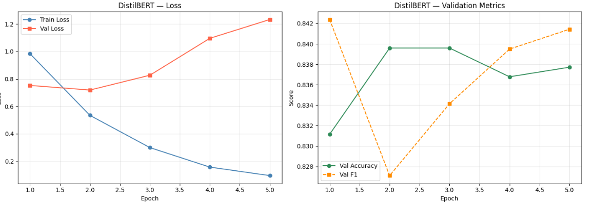
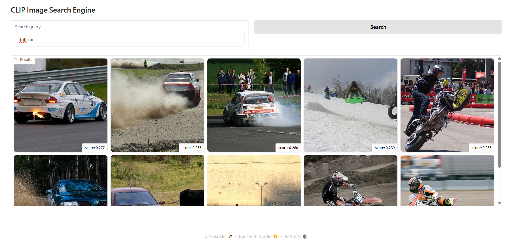

# Deep Learning Applications — Laboratory 2
## Sentiment Analysis and Image Retrieval with Transformers

This lab is a study on how to apply and fine-tune pre-trained transformer models for two distinct tasks: text classification via sentiment analysis on the [Rotten Tomatoes](https://huggingface.co/datasets/cornell-movie-review-data/rotten_tomatoes) dataset, and zero-shot image retrieval using [CLIP](https://openai.com/research/clip). The work is organized in three exercises: a feature extraction baseline, a full fine-tuning pipeline for DistilBERT, and a text-to-image search engine built with CLIP and deployed via a Gradio interface.

---

## Exercise 1 — Tokenization, Feature Extraction and Baseline

### Dataset

The Rotten Tomatoes dataset is a binary sentiment classification benchmark: movie reviews labeled as positive (1) or negative (0). It is perfectly balanced across all splits — 533 samples per class in train, validation and test — which means accuracy and F1 are directly comparable and no class balancing strategy is needed.

Review lengths follow a roughly gaussian distribution with a mean of ~21 words and standard deviation of ~9.5, consistent across all splits. This means truncation at 512 tokens is never actually triggered in practice.

A quick frequency analysis of the most common words per class reveals that positive and negative reviews share most of the high-frequency vocabulary (`film`, `movie`, `like`, `story`), with a few meaningful differences: words like `bad`, `doesn` appear in the top-15 negatives, while `funny`, `best`, `love` appear in the top-15 positives. This confirms that sentiment classification here requires understanding context and tone, not just bag-of-words features.

### Tokenization

The tokenizer used is DistilBERT's WordPiece tokenizer (vocab size: 30,522). WordPiece handles out-of-vocabulary words by splitting them into subword units (e.g. `schwarzenegger` → `schwarz`, `##ene`, `##gger`), which allows the model to process virtually any input without unknown token issues. Inputs are padded to the length of the longest sequence in each batch, and an `attention_mask` tensor marks real tokens (1) vs padding (0) so the model ignores padding during attention computation.

A batch of 4 samples with lengths 47, 52, 10, 24 tokens gets padded to shape `(4, 52, 768)` — each token across the full sequence length receives a 768-dimensional contextual representation. The `[CLS]` token at position 0 aggregates information from the entire sequence through the self-attention layers and is used as the sentence-level feature for classification.

### Baseline — DistilBERT `[CLS]` features + LinearSVC

DistilBERT pretrained on BookCorpus + English Wikipedia is used as a frozen feature extractor. For each review, the `[CLS]` token embedding (768-dimensional) is extracted without any fine-tuning and passed to a `LinearSVC` classifier (with `StandardScaler` preprocessing). This establishes how much discriminative power the pretrained representations already carry for sentiment, without any task-specific adaptation.

| Model | Validation Accuracy | Validation F1 | Test Accuracy | Test F1 |
|:---|:---:|:---:|:---:|:---:|
| DistilBERT `[CLS]` + LinearSVC | 82% | 0.82 | 79% | 0.80 |

A solid result for a zero-adaptation baseline. The ~3% gap between validation and test accuracy is normal and indicates good generalization. This is the reference to beat with fine-tuning.

---

## Exercises 1.3 + 2 — Fine-tuning Pipeline

Exercises 1.3 (fine-tuning baseline) and 2 (pipeline consolidation) were developed together as a single effort. Rather than doing a quick one-off fine-tuning in 1.3 and then refactoring in 2, the reproducible pipeline was built directly from the start using `OmegaConf` for configuration management and Weights & Biases for experiment tracking.

### Model

`AutoModelForSequenceClassification` from HuggingFace with `distilbert-base-uncased` as backbone. The classification head consists of a `pre_classifier` linear layer followed by a `classifier` linear layer — 4 parameter tensors in total, 592,130 parameters (~0.88% of the full model's 66,955,010 parameters). The backbone's 100 parameter tensors are initialized from the pretrained checkpoint; the head is randomly initialized and must converge from scratch. During training, **all parameters are updated** — this is full fine-tuning, not linear probing.

The dataset is tokenized once upfront using `Dataset.map` with `batched=True` for efficiency, and batches are dynamically padded at collation time via `DataCollatorWithPadding`.

### Training Configuration

| Hyperparameter | Value |
|:---|:---:|
| Model | `distilbert-base-uncased` |
| Optimizer | AdamW (HuggingFace Trainer default) |
| Learning rate | 4e-5 |
| Batch size (train) | 32 |
| Batch size (eval) | 64 |
| Epochs | 5 |
| Warmup ratio | 0.1 |
| Weight decay | 0.01 |
| Evaluation strategy | Per epoch |
| Logging strategy | Per epoch |
| Best model selection | `load_best_model_at_end=True` |

### Results

**Final test set evaluation (after 5 epochs):**

| Metric | Value |
|:---|:---:|
| Test Loss | 0.762 |
| Test Accuracy | **84.15%** |
| Test F1 | **82.81%** |
| Training loss (avg over 5 epochs) | 0.414 |
| Total training steps | 670 |


*Training loss vs validation loss and validation accuracy/F1 across 5 epochs.*

Fine-tuning gives a net gain of ~5 percentage points in accuracy over the frozen feature extractor baseline (79% → 84.15%), confirming that end-to-end adaptation of the entire network is what drives the improvement. The training loss of 0.414 averaged over all epochs reflects the early high-loss epochs before the model adapts — the model is learning steadily throughout training.

Based on the validation dynamics visible in the training curves (see plot), the model shows signs of overfitting in later epochs: training loss continues to decrease while validation loss diverges upward. This suggests that stronger regularization — increasing `weight_decay`, adding dropout to the classification head, or reducing the learning rate — would likely improve final test performance. Early stopping would also be a reasonable addition.

**Comparison with baseline:**

| Model | Test Accuracy | Test F1 |
|:---|:---:|:---:|
| DistilBERT `[CLS]` + LinearSVC (frozen) | 79% | 0.80 |
| DistilBERT fine-tuned (full, 5 epochs) | **84.15%** | **82.81%** |

---

## Exercise 3.3 — CLIP Text-to-Image Retrieval

### Overview

The third exercise moves to a completely different modality: given a natural language query, retrieve the most semantically relevant images from a gallery. This is possible without any task-specific training thanks to [CLIP](https://openai.com/research/clip) (`clip-vit-base-patch16`), a model trained with contrastive learning on 400 million image-text pairs. CLIP projects both images and text into the same 512-dimensional embedding space, where cosine similarity between modalities is meaningful — a text query and a semantically matching image will be close in this space even if the model has never seen that exact combination during training.

The gallery used is the test split of [Flickr8k](https://huggingface.co/datasets/jxie/flickr8k) (~1000 images of everyday scenes).

### Implementation

The system is split into two scripts:

**`build_index.py`** — Offline indexing. Loads the Flickr8k test split, extracts CLIP image embeddings for all images in batches of 64, and saves the resulting matrix to disk as `image_index.npy`. The embedding pipeline bypasses `get_image_features()` and calls `vision_model` + `visual_projection` directly for explicit control:

```python
vision_out = model.vision_model(pixel_values=inputs["pixel_values"])
pooled = vision_out.pooler_output            # (batch, 768)
projected = model.visual_projection(pooled)  # (batch, 512)
embeddings = F.normalize(projected, dim=-1)  # unit vectors
```

**`app.py`** — Online retrieval. Loads the precomputed index and, given a text query, computes its CLIP embedding using the symmetric pipeline on the text side (`text_model` → `text_projection` → `F.normalize`). The top-k images are retrieved via dot product (equivalent to cosine similarity since both embeddings are L2-normalized):

```python
scores = (image_index @ text_emb.T).squeeze()
top_indices = np.argsort(scores)[::-1][:top_k]
```

The retrieval is fast at inference time since the index is precomputed — only the text embedding needs to be computed on the fly per query.

### Running the App

**1. Build the index (run once):**
```bash
python build_index.py
```
This downloads the Flickr8k test split and the CLIP model on first run, then saves `image_index.npy` in the working directory. Takes a few minutes depending on hardware.

**2. Launch the Gradio interface:**
```bash
python app.py
```
The app starts a local server at `http://127.0.0.1:7860`. Type a query in the search box and click **Search** to retrieve the top 10 matching images.

**Example queries:**
- `"a dog playing in the park"`
- `"a person riding a bicycle"`
- `"children playing on the beach"`
- `"a man climbing a mountain"`


*The Gradio search interface. Natural language query → top 10 matching images from Flickr8k.*

### Requirements

```
transformers
datasets
torch
gradio
numpy
Pillow
```

```bash
pip install transformers datasets torch gradio numpy Pillow
```

---

## Notes

- The `[CLS]` token in DistilBERT accumulates a global sentence representation through the self-attention layers. It is not architecturally special — it is a convention the model learns to use during pretraining on masked language modeling.
- DistilBERT is a distilled version of BERT-base: 6 layers instead of 12, ~40% fewer parameters, ~60% faster inference, retaining ~97% of BERT's performance on GLUE benchmarks.
- CLIP's contrastive training objective (InfoNCE loss) pushes matching image-text pairs close together and non-matching pairs apart in the shared embedding space. This is what enables zero-shot retrieval with no task-specific training on Flickr8k.
- `datasets.config.IN_MEMORY_MAX_SIZE = 0` in `build_index.py` disables HuggingFace's multiprocessing cache to avoid PIL image serialization issues on some environments (`num_proc=1` is set for the same reason).
- The `logging_strategy="epoch"` argument in `TrainingArguments` is important for WandB: without it, the Trainer logs every `logging_steps` steps (default 500), making curves appear step-indexed rather than epoch-indexed and harder to interpret.
